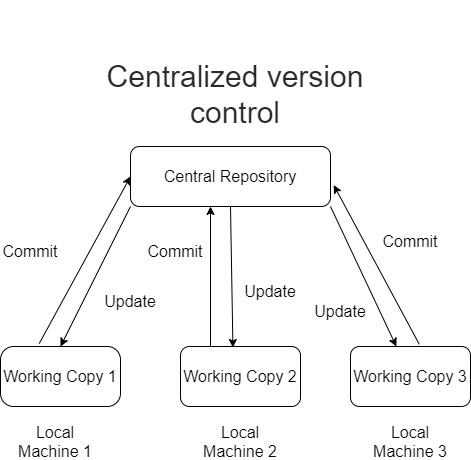
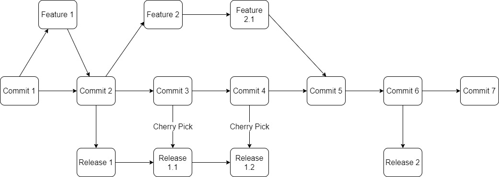
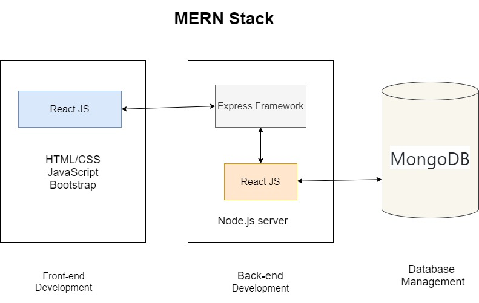
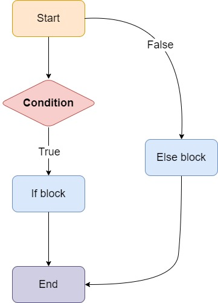

# T3A1Workbook
### GuangJian Chen
#### CAS022113
---

#### Q1. Provide an overview and description of a standard source control process for a large project
  
The standard source control process refers to the operations on tracking and manipulating code base changes within a project.

When developers need to manager the code base with modifications and history, it will surely become a challenge task. They need to corporate with other developers within a team at the same time and aware the state quo of  other developers working status. They try to efficiently allocate tasks to team members and solve the code conflicts to avoid bugs. And they want a code base backup plan in case they want to rollback the code. At this moment, **Source code management (SCM)** is a systematic toolkit which can help developers with all the problems above. The full history of modifications to a code base is tracked and code conflicts are easily spotted and solved  when merging commits from other team members by implementing SCM.

There is two mostly used SCM methods: **Centralized Version Control System(CVCS)** like **Concurrent Version System(CVS)** and **Distributed Version Control System(DVCS)** like Git. 

CVCS are implemented on the concept that there is a  central repository(server) that contains all of the history of the code, and developers(clients) will communicate with the server and pulls specific version of the code from the server to their local machine. And after clients making their own changes they can commit their changes to the server and producing a new version of code into the central repository. When the commits, branches and tags becomes larger in a big project, process them and try to avoid any bug would be a huge burden for developers to manager and lead to low efficiency. Since branching and merging is much easier to accomplished in a distributed system within a large project, I tend to utilize **Trunk-based development (TBD)** to be implemented in this project.


In the trunk-based development model, developers work on code in a single branch called ‘trunk’. Usually the trunk is the master branch. All developers can divides their own changes into small updates and merges that updates into trunk. 

For frequent updates purpose, short-lived feature branches are created. A few small commits are submitted and then being complied and tested in the short-lived feature branch. If tests passed, the branch will be merged into trunk immediately. It ensures the development is truly uninterrupted and prevents hard to solved merge conflicts.

To further explain this workflow, an diagram is displayed below.



In the diagram, we can see the commits in the middle represents the trunk master branch. Developers create short-lived feature branches from trunk master branch and try the implememnt the feature in this branch. Once they pass test on their work, pull requests is submmited to merge the work into trunk. In the mean while, a Continuous Integration server which  is watching the trunk repository for changes and verifying if the trunk is bug-free will cherry pick the bugfix commit to merge into the corresponding release branch. The release branches are also being watched by the Continuous Integration server to ensure the code passes tests before being merge into realse version.
In trunk-based workflow, cherry pick mergring is implemented from trunk to release branch to avoid risk of regression in case developer forget to merge bug-fixes back to trunk.


  <details>
 <summary>Sources</summary>

  https://www.geeksforgeeks.org/centralized-vs-distributed-version-control-which-one-should-we-choose/
https://cloud.google.com/architecture/devops/devops-tech-trunk-based-development
http://qszhuan.github.io/agile/2018/10/09/the-things-you-need-to-know-about-trunk-based-development
  </details>

---

#### Q2. What are the most important aspects of quality software?

**Software quality** relates to two relevant but definite theories within the context of software engineer:

**1**. Software functional quality, which basically implies that the software accurately implements the tasks that developers look to perform for software users. Within the traits of functional quality are:

* Given requirements have to be met.
  Fulfilling specific requirement for intentional clients is the  prerequisite of functional quality. In the context of real work software design, all the relevant laws and regulations have to be seriously adhere to as well. Since the requirements might change during the process of developing, developers need to perceive and execute the proper requirements accordingly.
&nbsp;
* Ensuring the reliability.
Since bugs can lessen the reliability in software quality, undermine the safety and restrain the effectiveness in software running, developers should eliminate all the possible bugs to ensure a reliable and excellent experience for users.
&nbsp;
* Optimizing the   performance.
Obviously, poor software performance is not appreciated when the user  experience really matter in marketing.
&nbsp;
* Ease of learning and use is important when the software need to gain more new users.
When it comes to user experience and user interface, a comprehensive tutorial, a user friendly and appealing design are necessary in marketing. Development team also required to consider customers’ prospective. 

**2**. Structural quality, which essentially refer to properly structured and organized code. Within the characteristics of characteristics quality are:

* Testability.
The testing process should be simple and easily done to verify the functionality of the code. Developers are also required to consider all aspects of software running conditions and have all the necessary error handling process to handle the possible error gracefully.
 &nbsp;
* Maintainability.
The code needs to be well maintainable when developers try to refactor them. Ensure the Maintainability in code can help refactoring easily and mitigate bug introducing.
&nbsp;
* Understandability.
Readable code can help other team members and developers understand the code base fast and increase the efficiency when some one needs to take over the job.
&nbsp;
* Efficiency.
In order to optimize software performance, developers intend to use fewer resources as possible to run the software much more efficiently. 
&nbsp;
* Security
As long as the security problems such as cyber attacks , disruption in service and information theft arise these days, Security becomes much more critical when it comes to software structural quality.Developers should try to have a detailed and reasonable plan for handling software security design and dealing with all the possible security risks thoughtfully.

<details>
 <summary>Sources</summary>

  http://davidchappell.com/writing/white_papers/The_Three_Aspects_of_Software_Quality_v1.0-Chappell.pdf
  https://en.wikipedia.org/wiki/Software_quality
  </details>

---

#### Q3. Outline a standard high level structure for a MERN stack application and explain the components.

MERN stack is an integration of four technologies used to produce web applications. The four letters in MERN represents MongoDB, Express, React and Node.js accordingly. And the MERN is implemented in three parts: Front-end development, Back-end development and database management.
&nbsp;

1. Front-end: React
In MERN, React is a open-source JavaScript framework which is used to build visual user interfaces for the front end development with the helps of built-in components and methods in the library. React's virtual DOM pattern can help developers easily manipulate the DOM node elements visually.React is responsible for rendering viewing layer in the Model, View and Controller(MVC) design.
&nbsp; 

2. Back-end:
* Express
Express is a web framework which collaborates with Node.js to finish the jobs in back-end development. Express empowers URL routing and handling HTTP requests and responses. It also helps produce RESTful API and represents the controller in MVC design.

* Node.js
Node.js is a JavaScript runtime environment which enable running JavaScript away from web browser. Node.js is a popular when it comes to back-end development and in particular dealing with API request.

&nbsp; 
3. Database Management
* MongoDB
MongoDB is non-relational and document-oriented database which stores and manipulates data in key-value pair document format.A benefit of NoSQL document database is you don't need to define schema prior to add or manipulate data, which able to have large capacity of data in MongoDB and make the communication between  front end and back end efficiently. MongoDB represents the model within MVC architecture. With the help from Mongoose which is an object data modelling(ODM) module offering a schema-based solution to model the data, MongoDB can produce defined schema to apply functionalities such as type casting, validation and query building in database management.

<details>
 <summary>Sources</summary>

  https://www.mongodb.com/mern-stack
  https://reactjs.org/tutorial/tutorial.html
  https://devcenter.heroku.com/articles/getting-started-with-nodejs
  https://developer.mozilla.org/en-US/docs/Learn/Server-side/Express_Nodejs/Introduction
  https://mongoosejs.com/
  </details>


---

#### Q4. A team is about to engage in a project, developing a website for a small business. What knowledge and skills would they need in order to develop the project?

When it comes to developing a web app within a team, there are lots of aspects to consider to produce successful product for customer. I intend to outline the following factors to see the whole picture:

1. **Planning**
Planning is a extremely critical process to be implemented before any marketing activity. When a team design a web app for specific customer, it’s literally selling a product to customer. Planning helps organizing and defining the marketing goals the team want to achieve and drawing out strategies and guidelines to achieve them. 
&nbsp; 
In the planning stage, all the team members need to well understand different expected outcomes of according stage in developing a successful product. For the small business as customer side in this case, the team needs to gather sufficient information from all the marketing entities. 
&nbsp; 
For the team itself, the strengths and weakness of each team member need to be analyzed for decision making purpose. For the small business, the team need to fetch necessary marketing information and clarify what the small business want the web app to be. Although the small business normally would do the  marketing research for the targeted user and share the information with the team, the team still need to do basic marketing research such as user stories to understand the targeted user better.
&nbsp; 
After all the necessary marketing information being collected, the team should analyse and discuss the information, all the goals of different stages in development and deployment well be made and documented by decision making. The documented content should  consist of what tech stacks be used, how to meet the needs of the small business, what features need to highlighted and other supporting feature in the web app, the timeline scope of each task, what and how the development process and workflow is implemented in the web app design, what and how the tests to apply to ensure the web app to be free of bugs, etc.
&nbsp; 
2. **Web application development and management**
After the planning stage, the team is going to implement the developing process as planned in a time-limited manner. In these process, there are some factors involved as follow:

* Communication
Communication skill is a critical factor to make the working flow efficiently in a team. To produce high-qualified product, team members need to shared and deliver correct and latest information and opinion in no time.
&nbsp; 
* Stack skills
Stack skills are obviously the fundamental part of developing software. Developer requires sufficient knowledge and stack skills to accomplish all the functionalities that the team want to achieve. For the web app development, team members require grasp the HTML/CSS and JavaScript, the team agree on frameworks which implement and manege the front-end and back-end functionalities and a database Management system for server side.
&nbsp; 
* The appealing view on Front end UI design
The purpose of the beautiful UI design is simply for getting more and more users to stick to the web app as the product. The design should not be complicated and ease of use is applied.
&nbsp; 
* Features implementation
As producing high quality code,  developers need to ensure the code is readable, maintainable for convenience in taking over or follow up jobs. Bugs suspecting, elimination and handling is crucial when coding. All the necessary testes to cover any situation when running to ensure the reliability. The code should be clean and follow all the coding conventions such as make the code DRY to ensure the efficiency. Developer should also try to optimize the performance by considering the average, worst and best big O runtime when choosing proper sorting and searching algorithm.
&nbsp; 
* Accessibility
For marketing, regulations complying and humanity empathy reasons, the web application should not only be accessible to different devices, but also deliverable to anyone regardless of disability.
&nbsp; 
* Version control
Choosing the appropriate version control system to trailing and administer the changes in web app design can increasing the working efficiency.
.Tests
Implement automatic testing covering all aspects in development ensure the quality of web application and user experience. It;s the most important part in software design to raise the efficiency in development stage.
&nbsp; 
* Security
For law complying and protecting software and personal and marketing data information reasons, security plays an important role in our planning list. Developer need to has a detail plan to deal with all possible risk situation no matter from hard ware damaging or malicious cyber attacking. Developer should apply the data integrity and availability, user authentication,account authorization properly.

3. **Deployment**
At the deployment stage, the team need to consider the optimized performance when the app being deployed and balance out the server service price to choose the proper server supplier to deploy. Also the security and maintainability.

<details>
 <summary>Sources</summary>

  https://ascendle.com/ideas/14-skills-your-app-development-team-must-have/
  </details>


---

#### Q5. With reference to one of your own projects, discuss what knowledge or skills were required to complete your project, and to overcome challenges


After I finished my Ruby and Rails two-sided marketing place app at the end of term 2, there are some skills is gained and being practiced through the development as as following:

* The skill of identifying the target group and the needs of them or problem needs to be solved in the market place.
  &nbsp; 
* The skill of utilizing appropriate tools to design the overall plan. Using Trello to depict and track our tasks, arrange proper time management for each task and prioritize tasks in order. Using Balsamiq Wireframes app to design different viewport wireframes for the front end page design. Using graph drawing software to design sitemap and ERD(Entity Relationship Diagram).
  &nbsp; 
* Communication skill is needed when I need to represent the idea of may app to class with slide deck. Also, I need to communicate with my educator for all the issues relates to my project.
  &nbsp; 
* Searching skill is very useful when I need help or want to dive into specific content in coding. [stackoverflow](https://stackoverflow.com/）is my frequent visited forum when doing my project.
  &nbsp; 
* Utilizing GitHub to host the project repository and manger my project  with proper version control commands.
  &nbsp; 
* The overall MVC model mechanism in Ruby and rails needs to be well understood. The view layer of front end, the routing, the controller, the model, the CRUD functions and the relational databases, developers need to understand the each role of these to be played in the MVC mechanism.
  &nbsp; 
* The relationships with different entities in relational databases schema should be classified. The validation in model can validate the input before manipulation to enhance data security. Also, the type casting, validation and any restriction of all the attributes of entities ensure the data validity and security in database.
&nbsp; 
* Utilizing various gem or library for convenient purpose. For front end UI design, bootstrap or tailwind framework can help building clean and appealing view with overall HTML/CSS and JavaScript integration. For authentication feature, Devise gem can help setting up functional scaffold in very short time. Pundit gem for user authorization feature to easily define authorization policy for specific user group to access specific data in the web app. The skill of implement appropriate gem or library can save a lot of time.
  &nbsp; 
* The third party service such as Amazon Web Services which can uphold the assets to optimize the performance and reduce the size of our source code.
  &nbsp; 
* The skill of deploying the  source code in proper platform such Heroku.
  &nbsp; 
* Understand all relevant industry law and regulation such as Privacy Act and copy right related law.
Implement coding convention in Ruby and Rails. Such as naming convention and Don’t Repeat Yourself in code.
&nbsp; 
* Tests should be applied to ensure our function execute as  expected and the outcome is valid. Also, the proper exception handling in Ruby should be well understood and implemented.
  &nbsp; 
* Understand the security matters not just coming from cyber attacks, but also relate to human error, data validation, information compromised and hardware damaging.
  &nbsp; 
* Timeline management is challenging when the time is ticking for each task in development. And developer need to get used to perform intensive tasks in a limit time and ensure the efficiency at the same time.

	

---

#### Q6. With reference to one of your own projects, evaluate how effective your knowledge and skills were for this project, and suggest changes or improvements for future projects of a similar nature


1. Planning at the beginning

As I mentioned in Question 5, planning process is important and professional at the beginning of the development. I need to:

* Identify the goal of purpose of my app. This process requires basic marketing research and decision making.
&nbsp; 
* Identify the targeted user group and potential visitor group. User story is an effective method to spot who would be interested in my app with customers’ prospective.
&nbsp; 
* After I chose the idea, I consulted with my educator to settle the idea which requires communication practicing.
  &nbsp; 
* Setting up the detail development process plan in Trello. Trello is a Kanban-style application for tracking and manager our detailed working process. I can arrange the order of all tasks and priorities the important ones and label them. Also the most important feature for me is the timeline setting which helps regulate my time management.
  &nbsp; 
* Wireframe and site map design provides a clear vision on the whole front end UI picture that I want to achieve and present. Three view port design ensure the accessibility in my app.
  &nbsp; 
* And then I need to design the Entity Relationship Diagram for the database. I need to design what kind of data I need in my app and setting up data restriction, data type and relationship between them
  &nbsp; 
* After finishing the Entity Relationship Diagram schema, wireframe and marketing purpose clarification, I made a slide deck to represent it in my class which is similar to real world marketing presenting. The process facilitate my communication and sharing skill.
  
2. Actual development on Front end, Back end and database management
   
* For the front end, I practiced how to implement HTML syntax integrated with ruby syntax in ‘erb’ extension HTML file to represent the view layer in the MVC pattern design. For UI visibility, I used the Bootstrap framework to decorate the page with Bootstrap library. Applying corresponding viewport definition in CSS to make the app more accessible. 
  &nbsp; 
* For the back end, I practiced how to setup the routes of directing the URL requests from front end browser to the correct method of corresponding controller. I practiced how to setup the controller with different CRUD (create, read, update, delete)methods to fetch or manipulate data in corresponding model. Within the corresponding model, I practiced how to fetch or read data in PostgreSQL with certain query command and setup data validation and type casting. Also, the relation statement has to be carefully defined in the model as well. It’s really a challenge for me to correctly define the restriction and relationship in model to avoid violating the setting in schema. I have encountered several database roll back error but these experience really pay off because I can understand better on the mechanism after each fixing.
  &nbsp; 
* In the development, I learned how to search and use proper gem library to increase the efficiency. Some well developed gem such as Devise gem can be really handy when I want to implement authentication feature in a short time. I practiced how to apply coding conventions such as naming and format in Ruby and Rails. I learned how to find a solution from Rails documentation and [stackoverflow](https://stackoverflow.com/
). I tried to make comments to make the code more readable. I tried to apply the DRY on code to make it look cleaner. I practiced how to use third party service such as Amazon Web Services (AWS) to uphold my assets of my app securely and how to deploy my app on Heroku correctly.

3. Test
Testing is an essential process of verifying if the app is bug free and ensure the the code can act as I expected. I practiced using begin and rescue ruby error handling syntax to gracefully deal with potential exception. 
&nbsp; 
4. ReadMe
The read-me documentation is organized and introducing all the necessary aspects of the web app in detail.
&nbsp;
5. Challenges in development
The most challenging thing happened is time management. In the middle of the development, I got beaten by database roll back problem and after long time of search and consulting with educator I waste too much time on the problem and had no choice to adjust the time spending on implement test defining and payment feature in my app. It gave me a lesson on the importance of proper time management. Another challenge is on practicing the appropriate version control. Although I used branch to separate the features and tried to commit for each small purpose at the beginning, I still need to facilitate correct commit habit.

---

#### Q7. Explain control flow, using an example from the JavaScript programming language


Control flow refers to the sequence of executions or function calls in an an imperative programming language based on specified conditions. Normally, JavaScript’s statement execution order is from left to right and from top to bottom like how people usually read a news paper. However, with the subtle use of Conditional statements and loops JavaScript, we can change the order in control flow of JavaScript and decide what statement to be executed and what statement to be skipped.

##### Conditional statements and loops
1. Truthy and Falsy
In JavaScript, values are being evaluated to be truthy and falsy value. 
The`false`,`0`, `-0`, `''`,`null`,`undefined`, and`NaN` are evaluated to be falsy value. Besides, all other values are evaluated to be truthy.

2. Logical Operator `||`
The logical OR operator`||`examines both sides, and returns a boolean value. That boolean will be `true`if one side or both sides of logical OR operator evaluate to truthy. If both of the expressions evaluate to falsy, then the boolean will be `false`.

```js script
true || false;        // true
100 > 10 || 10 > 100;    // true
false || false;       // false
10 > 100 || 10 > 50;  // false
```

3. Logical Operator`&&`
The logical AND operator`&&`examines both sides, and returns a boolean value. That boolean will be `false`if one side or both sides of logical OR operator evaluate to falsy. If both of the expressions evaluate to truthy, then the boolean will be `true`.

```js script
true || true;        // true
100 > 10 || 10 > 100;    // false
false || false;       // false
100 > 10 || 100 > 50;  // true
```

4. Logical Operator`!`
The logical NOT operator`!`is for reversing a boolean value, either from truthy to falsy or from falsy to truthy
```js script
let workingDay = true;
let holiday = !workingDay;
 
console.log(holiday); // Output : false

```

5. Comparison Operators
Comparison operators are for comparing two values and return a truthy or falsy boolean value depending on the evaluation of the comparison:

* `=== strict equal`
* `!== strict not equal`
* `> greater than`
* `>= greater than or equal`
* `< less than`
* `<= less than or equal`

6. If and If/else statements
If statements is the fundamental conditional statement which is widely used in many other programming language. The parentheses block following `if` clause will evaluate a value or expression in side. If the condition(the value or expression) evaluates to a truthy value, then the code within its curly brace body executes. Otherwise, the the code within its curly brace body will not execute. An `else if` blocks can be added to an initial `if` block to examine an extra condition. An`else`block can be attached after a`if`statement or a chain of`if-else if`blocks. The`else`block will only be executed when all thepreceding `if`condition evaluates to false.



```js script
let array = [1, 2, 3, 4, 5, 6];
if( array.length == 5){
  console.log("There are 5 elements in this array");
} 
else if (array.length < 5){
  console.log(`There are ${array.length} elements in this array`);
}
else {
  console.log("There are more than 5 elements in this array");
}

```

In this example, we can see the array length is 6, so the conditions in the first and second else if parentheses block are both evaluates to be false. And then the code in else statement code body will be executed.

7. switch Statement

The`switch`statements evaluates the switch expression against multiple`case`clauses with `===` strict equal comparison operators. If a case has the same result as the switch expression, the code body of that `case` clause will be executed. If there is no matching `case`, the default case code body will be executed. And if there is no matching case and even not a default case being defined in the switch statement, then nothing is done.
A`break`keyword should be applied in the case clause to finish. The missing of`break` keyword will lead to checking against each case sequentially until a break is met or the flow is broken.

```js script
let food = 'pizza';
 
switch (food) {
  case 'oyster':
    console.log('The taste of the seafood');
    break;
  case 'pizza':
    console.log('A delicious pie ');
    break;
  default:
    console.log('Enjoy your meal');
}
 
// Output: A delicious pie

```

In the example, we can see the food variable checks against the oyster first. And this will evaluate to false, so the code body of this case will be skipped. And then the food variable  will check against the pizza. It evaluate to true because the expression ‘ food === ‘pizza’ evaluates to true, so the code in this case will be executed. And because we have a break clause in the code body to finish, the loop will be stopping at this point.

1. `break` and`continue` operators
The `break`and `continue` operators are applied on control loops and other statements while the code being executed inside.

```js script
for (let x of [1, 2, 3,4]) {
  console.log(x);
  if (x === 2) 
  break;
}

// Output:
// 1
// 2
```

In this for loop example, we can see the output result onlt contains 1 and 2, becuase when the condition '`x === 2`' is applied and evaluated to be true, the `break` clause will make the execution end and leave the current statement which is the loop. Also the sequence of execution matters. If the `break` clause is placed before the `console.log(x)` execution, then it will exit the current statement immediately, which means the rest of executions in the second iteration will be ignored as well.

*continue* clause

```js script
for ( let i = 0; i<6;i++){
if(i ===3){
continue;
}
console.log(i);
}

// Output:
// 0
// 1
// 2
// 4
// 5

```

From the example we can see the loop output result jump over the number 3, yet `continue` clause is acting as the name suggesting to skip the current iteration and continue to the next iteration.

<details>
 <summary>Sources</summary>

  https://exploringjs.com/impatient-js/ch_control-flow.html
  https://www.codecademy.com/learn/introduction-to-javascript/modules/learn-javascript-control-flow/cheatsheet
  </details>

---

#### Q8. Explain type coercion, using examples from the JavaScript programming language

Type coercion in JavaScript refers to the process of converting value implicitly or explicitly from one data type to another.

* Explicit coercion
Explicit type coercion or type casting in JavaScript simply speaks about that developer directly instruct JavaScript to coerce an unexpected data type to an expected data type with built in methods such as `String()`,`Number()`, and`Boolean()` ike the following:

```js script
Number("16"); // returns 16
String(16); // returns "16"
Boolean(1); // returns true

```

We can see from the above code, the string "16" is explicitly converted to  a number 16 by applying Number() method, the number 16 is explicitly converted to  a string ‘16’ by String() method and 1 to a boolean by Boolean() method accordingly.

* Implicit type coercion
Implicit type coercion or type casting in JavaScript simply refers to the values could be converted into other data type by JavaScript automatically.

The implicit coercion in JavaScript commonly takes place when the operator is applied to the values of different types, such as
`0 == null`,`10/'2'`,`undefined + new Date()`, or it can be activated by the current context, like within the if (value) condition block, where `value` is converted to a boolean by JavaScript. However, the strict equality operator '`===`' does not provoke implicit type coercion. The loose equality operator'`==`'does both comparison and type coercion on the contrary.

In Javascript, there are three types of conversion：
1. String conversion
  
```js script
String(123) // (explicit)'123'
123 + ''    // (implicit)'123'

```
We can see both string type coercion produceing the same string '123', and yet the second one are applied implicitly with `+`operator.

```js script
String(Symbol('star'))   // 'Symbol(star)'
Symbol('star') + ''     // TypeError is thrown

```
From the above we can see symbol conversion can only appiled in the explicit way.

2. Boolean conversion
While the explicit way to convert value to a boolean is by using Boolean() built-in function, the implicit conversion occurs by applying logical operators `||`, `&& `, and `!` or within the logical context.

```js script
Boolean('')           // (explicit) retrun false
Boolean(0)            // (explicit) retrun false     
Boolean(-0)           // (explicit) retrun false
Boolean(NaN)          // (explicit) retrun false
Boolean(null)         // (explicit) retrun false
Boolean(undefined)    // (explicit) retrun false
Boolean(false)        // (explicit) retrun false
Boolean({})           // (explicit) retrun true
Boolean([])           // (explicit) retrun true
Boolean(6)            // (explicit) retrun true
if (6) { ... }        // (implicitly coercion within logical context, condition 6 will be evaluated to true)
!!6                  // (implicit due to logical operator) return true
6 || 'i18n'          // (implicit due to logical operator) return 6
6 && 'i18n'          // (implicit due to logical operator) return 'i18n'

```

In JavaScript, the`false`,`0`, `-0`, `''`,`null`,`undefined`, and`NaN` are evaluated to be falsy value. Besides, all other values such as object, function, Array and Date are evaluated to be truthy.

The above example displays that the explicit and implicit type coercion and we can see with the logical operators`||` and `&&`, the conversion is done behind the scene and it actually return the value of original operands.

3. Numeric conversion

Implicit conversion is aroused by the following cases:
* comparison operators such as `>`, `<`, `>=` and `<=`.
* bitwise operators such as `|`, `&`, `^` and `~`.
* arithmetic operators such as `-`, `+`, `*`, `/` and `%`.   When operand is a string, the `+` does not provoke numeric conversion.
* loose equality operator `==` and `!=`. when both operands are strings, `==` does not provoke numeric conversion. When applying `==` to `null` or `undefined`, numeric conversion does not happen. `null` equals only to `null` or `undefined`, and does not equal to anything else. `NaN` does not equal to anything even itself.

```js script
null == 0               // false, null is not converted to 0
null == null            // true
undefined == undefined  // true
null == undefined       // true
NaN == NaN              // false
```

```js script
Number(null)                   // (explicit) return 0
Number(undefined)              // (explicit) return NaN
Number(true)                   // (explicit) return 1
Number(false)                  // (explicit) return 0
Number(" 88 ")                 // (explicit) return 88
Number("-88.56")               // (explicit) return -88.56
Number("\n")                   // (explicit) return 0
Number(" 12s ")                // (explicit) return NaN
Number(123)                    // (explicit) return 123
Number('2022')   // (explicit) return 2022
1 +'18'          // (implicit) return '118'
1 -'18'          // (implicit) return -17
169 != '188'    // (implicit) return true
10 > '5'         // (implicit) return true
8/null          // (implicit) return Infinity
true | 0        // (implicit) return 1

```

From the above, we can see the explicit JavaScript Numeric coercion will take leading and trailing whitespace, \n, \t characters away at first, and it will return `NaN` if the cropped string does not represent a valid number. And it returns 0 when the cropped string is an empty string. There is a little different between `null` and `undefined`. The `null` one will return 0 while the `undefined` will get a `NaN`.

From the implicit JavaScript Numeric coercion we can see the 
`1 +'18'` has the 1 implicitly converted to `'1'` because the `'18'` is a string. Yet the `'-'` operator do implicitly convert the string `'18'` into 18 in the following expression. In the following expressions, the `'188'`, `'5'`,`null` and `true` are implicitly converted to 188, 5, 0 and 1 accordingly.

```js script
String(Symbol('star'))   // TypeError is thrown
Symbol('star') + ''     // TypeError is thrown

```
From the above we can see symbol conversion can not be appiled in neither explicit nor implicit way.

<details>
 <summary>Sources</summary>

  https://www.freecodecamp.org/news/js-type-coercion-explained-27ba3d9a2839/
  </details>

---

#### Q9. Explain data types, using examples from the JavaScript programming language

The data type basically specifies the categorization of data which informs the interpreter or compiler how the developer make use of the data.

There are three main groups of data types, which are primitive and composite data types as shown below:

**1. Primitive data types**
* String
The string data type is commonly for illustrating textual data. Strings are established within single or double quotes encompassing one or more characters. In some case, developer can include quotes as long as the inside quotes doesn't match the outer enclosing quotes.

```js script
const a = "Let's go."; // single quote inside double quotes
const b = 'She said "Bye!" and left.';  // double quotes inside single quotes
const c = 'We\'ll win.';     // apply escaping single quote with backslash

```
* Number
The number data type consists of negative or positive numbers with or without decimal place, numbers which be represented with exponential notation and three symbolic values which are `Infinity`, `-Infinity` and `NaN`. `Infinity` symbolizes the mathematical Infinity `∞`, which is an endless value that cannot be specified. `Infinity` and `-Infinity` is usually produced by deviding any nonzero number by zero. Meanwhile the `NaN` represents `Not a Number` value. When the cases are an invalid or an undefined mathematical operation applied, `NaN` is produced.

```js script
let a = 42;         // integer
let b = 68.88;       // floating-point number
let c = 3.16e+6;    // exponential notation, same as 3.16e6 or 4250000
let d = 3.16e-6;    // exponential notation, same as 0.00000316
console.log(8 / 0);  // Output: Infinity
console.log(-8 / 0); // Output: -Infinity
console.log(8 / -0); // Output: -Infinity
console.log("apples" / 2);       // Output: NaN
console.log(Number(undefined));  // Output: NaN 

```

* Boolean
There are only `true` and `false` value in boolean data type. It commonly being stored in a variable for a binary status with a meaningful variable name. And it also represents the result is true or not when a comparisons occurs.

```js script
let isAlive  = true;   // yes, it's alive
let isHoliday = false; // no, I'm not on holiday

let a = 6, b = 8, c = 10;
 
console.log(b > a) // Output: true
console.log(b > c) // Output: false

```

* Undefined 
The undefined type has only one value: `undefined`. If a variable has been declared and without been assigned a value, then the variable has a undefined value.

```js script
let a;
let b = "Hello World!"
 
console.log(a) // Output: undefined
console.log(b) // Output: Hello World!
```

* Null 
The null type has only one value: `null`. As the name suggests, the `null` means no value. But it doesn't mean `null` is equal to an empty string ("") or zero.

```js script
let a = null;
console.log(a); // Output: null
console.log(a == 0 ); // Output: false
console.log(a == '' ); // Output: false

```
* Symbol
A symbol is a unique and immutable data type which mean every time the Symbol() is invoked a new and unique symbol will be returned. Symbol is commonly used to identify object properties. The usage of symbol in an object is either for preventing name clashing between properties or avoid properties overwriting.

```js script
const mySymbol = Symbol()
mySymbol === Symbol() //false, because every symbol() produce unique symnol

const Name = Symbol()
const person = {
  [Name]: 'Ben'
}

person[Name] //'Ben'

const Walk = Symbol()
person[Walk] = () => 'Person is Walking'
console.log(person[Walk]()) //'Person is Walking'
```

**2. Composite data types**

* Object 
The object is a combination data type which is capable of storing collections of data inside. Normally a object in JavaScript has one or more key-value pairs as properties being wrapped in a set of curly braces. The key value pairs inside a object are comma-seperated. The property key name is constantly a string data type while the the property value can be any data type in JavaScript and even another object. In addition, when it comes to the case that the property value is a function data type in a key value pair, that property is commonly called method to differentiate it from other properties.

```js script
let emptyObject = {};
let person = {
    name: "Ben", //  the quotes around property name can be omitted if the name is a valid JavaScript name. 
    age: 18,
    gender: "Male",
    displayName: function() {
        console.log(this.name);
    }
};

```

* Array 
An array is a type of object that various values as elements are enclosed in a set of square brackets and the whole as a single variable. The elements inside a array are comma-seperated. Each element in an array has a numeric index, and the element itself can be any data type in JavaScript. One imprtant thing of array needs to be memorized is that the index start from zero and the first element in a array is array[0].

```js script
const colors = ["Red", "Yellow", "Green", "Orange"];
const cities = ["Sydney", "Paris", "New York"];
 
console.log(colors[0]);   // Output: Red
console.log(cities[2]);   // Output: New York

```

* Function
The function is callable object which executes a block of code. Functions can be assigned in variables. Functions can be assigned to a key as value in objects. Functions can be an element in arrays. Functions can be transmitted as arguments to other functions, and functions can be returned from functions as well.

```js script
function greeting(name){
    return "Hello, " + name;
}
function displayGreeting(greetingFunction, userName){
    return greetingFunction(userName);
}
 
let result = displayGreeting(greeting, "Ben");
console.log(result); // Output: Hello, Ben
```

<details>
 <summary>Sources</summary>

  https://flaviocopes.com/javascript-symbols/
  https://javascript.info/types
  https://www.tutorialrepublic.com/javascript-tutorial/javascript-data-types.php
  </details>

---

#### Q10. Explain how arrays can be manipulated in JavaScript, using examples from the JavaScript programming language.

In JavaScript, there are a lot of built-in methods manipulating arrays.

* push(...items) and pop()
The `push(...items)` method operates by adding the items to the end of the array  and altering the original arrays. While `pop()` is oppositely removing the last element of the array and then return the altered array.

```js script
// Initial a array and stored in a variable in JS
let arr = [1,2,3,4,5,6] 
arr.push(7)
console.log(arr) // output: [1, 2, 3, 4, 5, 6, 7]

```


```js script
let arr = [1,2,3,4,5,6] 
arr.pop()
console.log(arr) // output: [1, 2, 3, 4, 5]

```
* shift() and unshift(...items)
The `shift()`method extracts an item from the beginning of an array, whilst`unshift(...items)` method adds items to the beginning of an array.

```js script
// Initial a array and stored in a variable in JS
let arr = [1,2,3,4,5,6] 
arr.shift()
console.log(arr) // output: [2, 3, 4, 5, 6,]

```

```js script
let arr = [1,2,3,4,5,6] 
arr.unshift(0)
console.log(arr) // output: [0, 1, 2, 3, 4, 5, 6]

```

* splice()
The `splice()` method alters an array by adding, removing and inserting elements. The syntax is:

```js script
array.splice(index[, deleteCount, element1, ..., elementN])

```

`Index` in the syntax is the starting point for the elements that we want to change in the array.
`deleteCount` is the number of elements to be removed starting from the `Index`.
`element1, …, elementN` is the element(s) to be added。

```js script
let arr = [1,2,3,4,5,6] 

arr.splice(2, 1); // from index 2 remove 1 element

console.log(arr); // output: [1, 2, 4, 5, 6]
```

```js script
let arr = [1,2,3,4,5,6] 

// remove 2 first elements and replace them with another elements
arr.splice(0, 2, 12, 16);

console.log(arr); // output: [12, 16, 3, 4, 5, 6]
// remove 2 first elements
let removed = arr.splice(0, 2);
console.log(removed); // output: [12, 16]
```

* slice()
The `slice()` method copies an array from index start to end (end is not included) and returns that copied part as a new array. It does not alter the original array. The syntax is:

```js script
array.slice([start], [end])
```

```js script
let arr = [1, 2, 3, 4, 5, 6];

console.log( arr.slice(1, 3) ); // output: [2, 3] (copy from 1 to 3)

console.log( arr.slice(-2) ); // output: [5, 6] (copy from -2 till the end)
```

* concat
The `concat` method binds two arrays together or attach more elements to an array and then return the alter array. The syntax is:

```js script
array.concat(arg1, arg2...)
```

The arguments inside can be either either arrays or values. If the argument is an array, then all its elements are copied. Alternatively, the argument itself is copied.

```js script
let arr = [1, 2, 3];

// produce a new array from: arr and [a,b]
console.log( arr.concat([a,b]) ); // output: [1, 2, 3, a, b]

// produce a new array from: arr and [a,b], then value 4 and 5
alert( arr.concat([a,b], 4, 5) ); // output: [1, 2, a, b, 4, 5]
```

If a argument inside is an array-like object which has a special `Symbol.isConcatSpreadable` property, then the argument will be processed as an array by concat method.

```js script
let arr = [4, 2];

let arrayLikeObject = {
  0: "ultimate",
  1: "number",
  [Symbol.isConcatSpreadable]: true,
  length: 2
};

console.log( arr.concat(arrayLikeObject) ); // output: [4,2,ultimate,number]

```

* Iterate: forEach
The forEacch method applies a function on all elements in an array. The syntax is:

```js script
array.forEach(function(item, index, array) {
  // ... function executions
});

```
```js script
["apple", "banana", "Cherry "].forEach((item, index, array) => {
  console.log(`${item} is at index ${index} in ${array}`);
}); // It will iterate throuogh the array from index 0 to the end of array
```

* indexOf(), lastIndexOf() and includes()
These three methods performs a searching functionality on an array and they has similar syntax.

  1. arr.indexOf(element, from) 
     It looks for `element` starting by index `from`, and returns the index if the element is found, otherwise it returns -1.
  2. arr.lastIndexOf(element, from) 
     Similar to the indexOf() method but with a reversal direction.
  3. arr.includes(element, from) 
     It seeks `element` starting from index `from`, returns true if the element is found.

```js script
let arr = [1, 2, 3, 4, 5, 6];

console.log( arr.indexOf(3, 1) ); // output: 2
console.log( arr.lastIndexOf(3, 4) ); // output: 2
console.log( arr.indexOf(7) ); // output: -1
console.log( arr.includes(1) ); // output: true

```

* find() and findIndex()
The `find` method will return the first element in the array which meets the given condition. While `findIndex` is similar to find method but it returns the index of the first element in the array which meets the given condition or -1 is returned if not found. The syntax is:

```js script
let result = arr.find(function(element, index, array) {
  // if element is found, itself will be returned and iteration is stopped
  // if element is not found, it returns undefined
});
```
```js script
let students = [
  {id: 1, name: "Ben"},
  {id: 2, name: "Amy"},
  {id: 3, name: "Leon"}
];

let student = students.find(e => e.id == 1);

console.log(student.name); // output: Ben
```

* filter()
The `filter()` method produces a new array if the elements of an array meet a certain condition. The syntax is:

``` js script
let newArr = arr.filter(function(item, index, array) {
  // If condition is met, then that element will be pushed to newArr array container and the iteration continues
  // If none of the element meets the condition, then it will return an empty array
});
```
```js script
let students = [
  {id: 1, name: "Ben"},
  {id: 2, name: "Amy"},
  {id: 3, name: "Leon"}
];

let newGroup = students.filter(e => e.id < 2);

console.log(newGroup.length); // output: 1
```

* map()
 The `map()` method produces a new array by calling a function on each element in an array. The syntax is:

```js script
let newArr = arr.map(function(element, index, array) {
  // returns the new value instead of element
});
```
```js script
let stringLength = ["String", "Methods ", "map"].map(e => e.length);
console.log(stringLength); // output: [6, 8, 3]
```

* sort()
As the name suggests, the `sort()` method alters the order of elements in an array and returns the sorted array. By default, if none function is defined in the sort method, then all elements in the array are converted to strings data type for lexicographic ordering comparisons.

```js script
let arr = [ 9, 6, 856 ];

arr.sort();

console.log(arr); // output: [6, 856, 9] Since the first character in '856' is 8 and '6' < '8' is true and '8' < '9' is true as well. 
```

So, if we want to perform our own version of sorting, a function should be explicitly defined as the argument in the sort() method.

```js script
function comparison(a, b) {
  if (a > b) return 1;
  if (a == b) return 0;
  if (a < b) return -1;
}

let arr = [ 9, 3, 5, 25, 5];

arr.sort(comparison);

console.log(arr);  // output: [3, 5, 5, 9, 25]

```

* reverse()
The `reverse()` method the order of elements in an array and returns the reversal array.

```js script
let arr = [1, 2, 3, 4, 5];
arr.reverse();
console.log(arr); // output: [5, 4, 3, 2, 1]
```
* split() and join()
The `split()` method is applied on string and it divides  splits the string into an array. The syntax:

```js script
string.split(separator, limit);
```

To produce an array, the `separator` will be a comma here.
The `limit` decides how many pieces of splits to be performed.

```js script
let names = 'apple, banana, cherry';
let arr = names.split(', ',2);
console.log(arr) // output: ["apple", "banana"]
let str = "apple";

console.log( str.split('') ); // output: ["a", "p", "p", "l", "e"] This is useful when we want to split the string into an array of letters.
```

The `join(separator)` method combines all array elements into a string and derveloper can specify the separator as a argument. The default separator is a comma.

```js script
let colors = ['red', 'blue', 'white'];

console.log(colors.join('-')); // output: red-blue-white

```

* reduce()
The `reduce()` method reduce() is commonly used to compute a single value according to an array. The syntax is:

```js script
let value = array.reduce(function(accumulator, element, index, array) {
  // ...
}, [initial]);

```

1. `accumulator` is the outcome of the preceding function 
call, if initial is provided and the accumulator will be the initial at the beginning. If the initial is omitted, then the accumulator will be initialize as zero.
1. `element` is the current array element.
2. `index` – is the current index in the array.

```js script
let arr = [7, 84, 32, 26, 6];

let total = arr.reduce((sum, current) => sum + current, 0);

console.log(total) // output: 155

```

From the above code, we can see the initial is provided and is 0. In the first iteration, the `current` is the first element in the array which is 7. So the `sum` will be `0 + 7 = 7`. In the second iteration the `current` is the second element in the array which is 84. So the `sum` will be `7 + 84 = 91`. And as the iterations continue, the sum will add up all the following element in the array one by one.

<details>
 <summary>Sources</summary>

  https://javascript.info/array-methods#splice
  https://www.freecodecamp.org/news/manipulating-arrays-in-javascript/
  </details>

---

#### Q11. Explain how objects can be manipulated in JavaScript, using examples from the JavaScript programming language.

An object is a non-primitive data type in JavaScript and it holds groups of related properties and functions as methods inside.

Almost the objects are instances of `Object` class in JavaScript and a regular object inherits properties and methods from `Object.prototype`.

An object can be created inJavaScript by two ways:
1. Object literal syntax

The object literal is simply an object being defined in the curly brackets with key/value pairs separated by a comma. The key would be property name and the value will be a value or function.

```js script
let empty = {}; // empty object with no key/value pair indide

// object with properties & method
let person = { 
                firstName: "Leon", 
                lastName: "Kennedy", 
                age: 21, 
                getFullName: function () { 
                        return this.firstName + ' ' + this.lastName 
                }
            }; 

```

2. Objects() Constructor
There are two object contructors methods. One is Object() constructor function creates an object wrapper for the given value by using the new keyword. Developer can define properties and methods with dot notation or through the square brackets, as shown below.

```js script
let person = new Object(); //  create an empty object

// Define properties and methods to the person object     
person.firstName = "Leon"; // Apply dot notation to define property
person["lastName"] = "Kennedy"; // Apply square brackets to define property
person.age = 21;
person.getFullName = function () {
        return this.firstName + ' ' + this.lastName;
    };


```

Another contructors method is Object.create() which employs an present object as prototype to return an object. The yntax is:

```js script
Object.create(prototype[, propertiesObject])
```

prototype : It is the prototype object of the newly created object.
propertiesObject : This parameter is optional and it adds the enumerable properties of this object to the newly created object.

```js script
 const passTicket = {
       isValid: false,
       introduction: function() {
          console.log(`It is a/an ${this.name}. Is it valid? ${this.isValid}`);
  }
};

const trainTicket = Object.create(passTicket);

trainTicket.name = "Opal Card"; // "name" is a property set on "trainTicket", but not on "person"
trainTicket.isValid = true; // inherited properties can be redefined

trainTicket.introduction();
// expected output: "It is a/an Opal Card. Is it valid? true"
```

And there are more object methods can manipulate objects as shown below:
* assign()
The Object.assign() method duplicates the values and properties from one or many source objects to a single target object and returns the altered object. The syntax is:

```js script
Object.assign(target, ...sources)
```

`target` is the source object which the sources’ properties will apply to and being return after modification.

`sources` are all the source objects and the properties.

```js script
const target = { a: 5, b: 6 };
const source = { b: 7, c: 8 };

const returnedTarget = Object.assign(target, source);

console.log(target);
// expected output: Object {a: 5, b: 7, c: 8}
// We can see the original target object is changed as well.
console.log(returnedTarget);
// expected output: Object {a: 5, b: 7, c: 8}
// The same b property'value is replaced by 7
```

* defineProperties() and defineProperty()
Thie defineProperties() method adds or changes plural  properties on an object straightaway and returns the object. While defineProperty() has the same functionality as defineProperties method but only defines with single propertiy at one time.

```js script
// defineProperties()
const object1 = {};

Object.defineProperties(object1, {
  name: {
    value: 'ben',
  },
  property2: {}
});

console.log(object1.name);
// expected output: ben


// defineProperty()
const object2 = {};

Object.defineProperty(object2, 'height', {
  value: '170',
});

console.log(object2.height);
// expected output: 170

```

* entries()
The entries() method returns an array containing enumerable key/value pairs of an object.

```js script
const agent1 = {
  firstName: "Leon", 
  lastName: "Kennedy",
};

for (const [key, value] of Object.entries(agent1)) {
  console.log(`${key}: ${value}`);
}

// output: "firstName: Leon"
           "lastName: Kennedy"


```

* freeze()
As the name suggests, freeze() method is used for freezing an object returns the same object. This method will make the object immutable.

```js script
const person = {
  name: 'Leon'
};

Object.freeze(person);

person.name = 'Ben';  // Error is thrown in strict mode

```

* getPrototypeOf()
As the name suggests, freeze() method is used for getting the protptype of the given object.

```js script
const prototype1 = {
  length: 42
};
const object1 = Object.create(prototype1);

console.log(Object.getPrototypeOf(object1).length);
// output: 42
```

* hasOwnProperty()
This method checks if the object has the given property as its own property.

```js script
const object1 = {};
object1.name = 'apple';

console.log(object1.hasOwnProperty('name'));
//  output: true

console.log(object1.hasOwnProperty('height'));
// output: false
```

* seal()
While `seal()` and frozen() method are both used to create non extensible objects, `seal()` enables modificatons on the existing properties where as freeze() doesn't.

```js script
const object1 = {
  name: 'Leon'
};

Object.seal(object1);
object1.name = 'Ben';
console.log(object1.name);
// output: Ben;

object1.age = 18;
console.log(object1.age);
// output: undefined 
```

* valueOf()
This method returns the primitive value of the given object.

```js script
function Student(Name,id) {  
  this.Name = Name;  
  this.id = id;  
}  

Student.prototype.valueOf = function () {  
  return this.id + 50;  
}

// calling valueOf() method
Student1 = new Student('Leon',2);  
console.log(Student1.valueOf());
// output: 52 
```

* toString() 
This method returns the object as a string.

```js script
function Cat(name, breed) {
  this.name = name;
  this.breed = breed;
}

cat1 = new Cat("Catty", "Birman");
console.log(cat1.toString()); // [object Object] default object display
// We can defined own version of toString() method
Cat.prototype.toString = function () {
  return `${this.name} is a/an ${this.breed}.`;
};

console.log(cat1.toString()); // Catty is a/an Birman.
```

* keys()
This method returns an array of all enumerable property names of a given object.

```js script
const object1 = {
  a: 1,
  b: 2,
  c: 3
};

console.log(Object.keys(object1));
// output: ["a", "b", "c"]

```

* values()
This method returns an array of all enumerable value names of a given object.

```js script
const object1 = {
  a: 1,
  b: 2,
  c: 3
};

console.log(Object.values(object1));
// output: [1, 2, 3]

```

<details>
 <summary>Sources</summary>

  https://developer.mozilla.org/en-US/docs/Web/JavaScript/Reference/Global_Objects/
  https://www.tutorialsteacher.com/javascript/prototype-in-javascript
  </details>

---

#### Q12. Explain how JSON can be manipulated in JavaScript, using examples from the JavaScript programming language.

JSON is the abbreviation of JavaScript Object Notation which is a text-based data format for data storing and delivering. Because JSON was derived from JavaScript, the syntax of JSON resembles JavaScript object literal syntax which consists of key/value pairs separated by a comma. However, JSOn is widely used by other programming languages as well.

JSON is wrapped by a curly braces `{}` like the JavaScript object literal syntax, but inside the JSON object, the key requires be written in a double quotes `""`.

```js script
// JSON object
const data = {
    "name": "Leon",
    "age": 22,
    "hobby": {
	  "reading" : true,
	  "gaming" : false,
	  "sport" : "bastketball"
    },
    "font_end_skills" : ["JavaScript", "HTML", "CSS"]
}

// accessing JSON object by dot notation and square brackets
console.log(data.name); // Leon
console.log(data['hobby']); // { gaming: false, reading: true, sport: "bastketball"}
console.log(data.hobby.gaming); // false
console.log(data.font_end_skills[1]); // HTML
```

* JSON.stringify()
This method can convert JavaScript objects into the corresponding JSON format.
```js script
// JavaScript object
const data = { "name": "Leon", "age": 22 };

// converting to JSON
const obj = JSON.stringify(data);

// accessing the data
console.log(obj); // "{"name":"Leon","age":22}"

```
* JSON.parse()
This method can convert JSON data into a JavaScript object
```js script
// json object
const data = '{ "name": "Leon", "age": 22 }';

// converting to JavaScript object
const obj = JSON.parse(data);

// accessing the data
console.log(obj.name); // Leon

```
<details>
 <summary>Sources</summary>

  https://www.programiz.com/javascript/json
  </details>

---

#### Q13. For the code snippet provided below, write comments for each line of code to explain its functionality. In your comments you must demonstrates your ability to recognise and identify functions, ranges and classes.

```js script
/* declares a Car class object and the defining code would be coded between the curly braces. */
class Car {

/* The constructor() method is for initializing the properties of this object. It is called every time a new instance 
of a class object is created in JavaScript. Here this constructor accepts an argument 'brand' and will make use of this 
argument inside the contructor code body.*/

  constructor(brand) {
  
  /* The 'this' keyword here is referencing to current newly created instance object. And by applying the dot notation
   on `this` keyword, the 'brand' parameter will be assigned to the a defined property 'name' on this car instance object.*/

    this.carname = brand;
  }

  /* A class object method with a defined name 'present' is defined and it can be called on the instance of the Car class object. */

  present() {

  /* This method returns an interpolated string of 'I have a ' concatenated with value of the carname property of this car instance. */

    return 'I have a ' + this.carname;
  }
}

/* It declares a subclass named Model with 'extends' keyword  following by the Car class object from which we want to inherit 
all the instance properties and methods. */

class Model extends Car {

/* The constructor() method is for initializing the properties of this object. It is called every time a new instance of a class 
object is created in JavaScript. Here this constructor accepts two arguments 'brand' and 'mod' and will make use of these arguments inside the contructor code body.*/

  constructor(brand, mod) {

/* The 'super' method calls the parents constructor method, and it enable developer to access the value of the brand argument the parent Car class here. Also, all the methods defined in the Car class is accessible by applying this extends and super syntax keyword. */

    super(brand);

/* The 'this' keyword here is different from the above 'this' keyword because the scope is different. Here, 'this' refers to 
this Model class and the mod parameter is passed from constructor to assign to the model property of this Model class. */

    this.model = mod;
  }

/* A class object method with a defined name 'show' is defined and it can be called on the instance of the Model class object. */

  show() {

/* This method returns an interpolated string of three parts join together. The present method is inherited from the parent 
Car class with the extend and super syntax. So in this Model class the present method can be invoked as well. The model is the 
property of this Model class. Because the + operator is applied here and the second part of interpolataion is a string data 
type, so the value of the model property will be implicitly convert to a string by applying toString() under the hood. At 
last, all three parts are concatenated to be a whole string and being return. */

    return this.present() + ', it was made in ' + this.model;
  }
}
/* It declears an array which contains three popular car band name strings as elements and be assigned to a variable 'makes' 
with `let` keyword which mean this makes variable is mutable. */

let makes = ["Ford", "Holden", "Toyota"]

/* The Array.from() method returns a static copied array object which is created with new Array keyword and has 40 elements. 
And this 40 elements start at the number 1980 and increment by 1. The i represents iterator. */

let models = Array.from(new Array(40), (x,i) => i + 1980)

/* It declars a function with two parameters 'min' and 'max'. */

function randomIntFromInterval(min,max) { // min and max included

/* Math.random() returns a random floating-point number greater than or equal to 0, and less than 1. Because by default the 
result of Math.random() never returns 1, and after rounding up with Math.floor() method it never return the biggest number as 
well but actually the `max` case here is inclusive, so it has to add 1 in the code block of Math.random() method to ensure the
 `max` edge case could be met. (max-min+1) here will the possible gap between min and max and plus the min itself which will 
 ensure the minimum edge case is the value of min. The possible gap + the min and being round up with Math.floor to ensure the 
 number is an integer. */

    return Math.floor(Math.random()*(max-min+1)+min);
}

/* This for loop is used tp iterate through the models array which is defined above with each model element. The first element 
of model array is 1980 and increment by, so the last element will be 2019. */

for (model of models) {

/* In each iteration the randomIntFromInterval method of this Model class will be invoked and being passed two arguments. 
These arguments actually represent the minimum index and maximum index of the makes array. So the returnning value of randomIntFromInterval method will be a random integer between 0 and 2 inclusively. By applying suqare brackets with `makes` 
array, we can access to a random element in makes array and assign this element to make variable. */

  make = makes[randomIntFromInterval(0,makes.length-1)]

/* This is similar to the above method. With the help from randomIntFromInterval method in this Model class, we assign a 
random year element from models array to model variable. */

  model = models[randomIntFromInterval(0,makes.length-1)]

/* In each iteration, a new Model instance is created with new keyword and the current make and model placeholders as 
parameters will be passed to the Model constructor and the value of make and model will be assign to respective Model 
properties. At last, this Model instance will be assigned to a variable name mycar. */

  mycar = new Model(make, model);

/* Becase mycar as our instantiated Model object instance has a same show() method as Model has, the show() method can be 
invoked and return a string like'I have a (brand) and it was made in (year)'. The the console.log() method will output this 
string in the console.*/

  console.log(mycar.show())
/*This loop will iterate 40 times becase the length of models array is 40 and it output 40 line of string in the console.*/
}

```